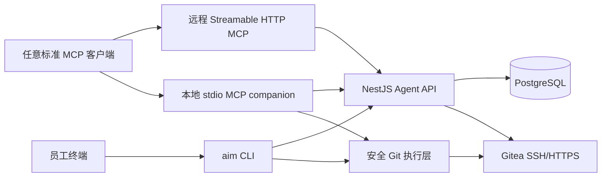

# aiManager MCP 与 CLI 设计

## 架构与边界

- 新增 [`apps/agent-tools`](apps/agent-tools)，同一 TypeScript 包产出三个入口：`aim` CLI、`aim-mcp` 本地 stdio MCP、`aim-mcp-server` 远程 Streamable HTTP MCP，复用平台客户端、凭据存储、Git 执行和输出格式。
- 远程 MCP 只操作需求、反馈、通知、成果等平台数据；本地 companion 聚合相同平台工具，并增加 clone/status/diff/branch/commit/push/PR/CI/release 等本机能力。
- Git 数据传输继续直连 Gitea，不把 clone/push 放进 NestJS；平台只提供身份、项目上下文、远程地址、权限与审计。

## 机器认证与权限

- 在 [`apps/api/prisma/schema.prisma`](apps/api/prisma/schema.prisma) 增加 `IntegrationToken`：仅保存 SHA-256 哈希、名称、scope、过期时间、最后使用时间和撤销时间；令牌明文只在创建时显示一次。
- 新增 `integrations` 模块及个人资料页令牌管理：员工可创建、查看摘要、撤销 `read`、`project:write`、`feedback:write`、`git:metadata` 等范围；CLI/MCP 用 Bearer PAT，保存到 macOS Keychain/Windows Credential Manager/Linux Secret Service，文件存储仅作为显式降级方案。
- 扩展全局认证策略，使 JWT 与个人令牌都解析为同一 `AuthUser`，并用 scope guard 约束 Agent API；现有项目角色校验继续作为第二层授权。
- Git push 默认使用员工已有 SSH Agent；HTTPS/PR API 使用员工自己的 Gitea PAT（由 CLI setup 引导并存钥匙串）。绝不返回或复用服务端 `GITEA_API_TOKEN`。

## 面向 Agent 的稳定 API

在 [`apps/api/src/app.module.ts`](apps/api/src/app.module.ts) 注册新的 `AgentModule`，薄封装现有 [`projects.service.ts`](apps/api/src/projects/projects.service.ts)、反馈、通知与 Gitea 服务，避免复制业务逻辑：

- `GET /api/agent/me/work`：待办、未读通知、待处理反馈聚合。
- `GET /api/agent/projects`、`GET /api/agent/projects/:id/context`：需求、沟通、成员、开放反馈、PR/CI、成果摘要一次返回。
- `GET /api/agent/projects/:id/git`：返回 HTTP/SSH clone URL、组织、默认分支、当前用户权限，不含密钥。
- 写接口覆盖发布/认领/加入协作、沟通/追加需求、反馈/评论、催办、验收与安全状态流转；保持现有服务层权限规则。
- 增加版本化能力声明、机器可读错误码、request id 和写操作审计，供 CLI/MCP 稳定处理。

## MCP 工具设计

采用每项能力独立工具；远程与本地各自控制在约 15 个高价值工具内，并提供 MCP resources/prompts：

- 只读工具：`get_my_work`、`list_projects`、`get_project_context`、`get_deliverables`、`list_feedbacks`、`get_notifications`、`git_status`、`git_diff`、`pr_status`、`ci_wait`。
- 写工具：`create_project`、`claim_project`、`join_development`、`post_update`、`create_feedback`、`comment_feedback`、`clone_project`、`create_branch`、`commit_changes`、`push_branch`、`create_pull_request`、`prepare_release`。
- Resources：`aimanager://projects/{id}`、`aimanager://feedbacks/{id}`；Prompts：实现需求、修复反馈、准备发布。
- 所有工具补齐 `readOnlyHint`、`destructiveHint`、`idempotentHint`；输出同时包含简洁文本和结构化 JSON，错误使用稳定 code。

## CLI 命令与 Git 安全

- 命令树：`aim auth`、`aim config`、`aim project`、`aim feedback`、`aim git`、`aim pr`、`aim ci`、`aim release`、`aim mcp serve`、`aim doctor`。
- `git` 使用 `execFile` 参数数组，不拼 shell；限制 cwd、Gitea 主机与组织；拒绝 `main` 直接推送、force/mirror、危险 refspec 和包含凭据的 URL。
- clone 后写入项目 ID 的本地元数据；branch 仅允许 `feature/`、`fix/`、`chore/`；提交前展示 status/diff 摘要并检查敏感文件。
- commit、push、创建 PR、release 必须确认：支持 MCP elicitation 时使用原生确认；不支持时生成短时 action id，要求员工执行 `aim approve <id>` 后才允许执行，避免 AI 自行确认。

## 部署、配置与验证

- 为远程 MCP 增加 Dockerfile、Compose 服务和 Caddy `/mcp` Streamable HTTP 路由；本地以 npm 包/内部制品发布 `aim` 与 `aim-mcp`，提供 Cursor、Claude、通用 MCP JSON 配置示例。
- 更新 [`.env.example`](.env.example)、[`README.md`](README.md)、`docs/cli.md`、`docs/mcp.md`、`docs/security.md`，明确浏览器 SSO 不适用于 Git、PAT/SSH 的职责和撤销流程。
- 测试覆盖：令牌哈希/撤销/scope、Agent API 权限、MCP Inspector 协议与 schema、CLI 命令快照、Git 临时仓库、危险命令拒绝、确认流程、真实 Gitea clone→branch→commit→push→PR→CI 回写 E2E。
