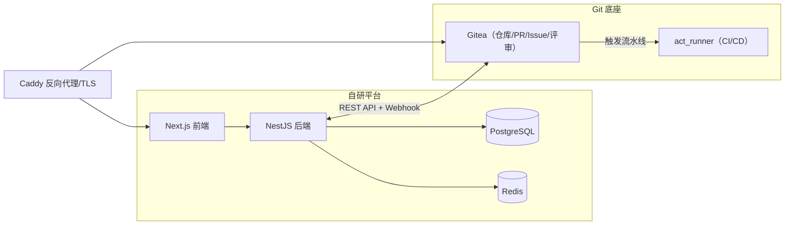

# 内部需求协作平台（需求发布—认领—开发—发布—反馈闭环）

## 1. 架构总览



- 域名规划：`app.公司域名` 指向自研平台，`git.公司域名` 指向 Gitea，`code.公司域名` 指向 Runner 产物/静态发布。
- 核心闭环：员工提需求 → 项目进入需求池 → 有能力的同事认领（先到先得）→ 自动在 Gitea 建仓 → 多人 PR + 评审 → Gitea Actions 自动构建/测试/发布 → 使用方提交反馈（映射为 Issue）→ 开发者 PR 迭代。

## 2. 技术栈

- Git 底座：Gitea（GitHub 兼容 REST API）+ act_runner（Gitea Actions，复用 GitHub Actions 语法）
- 后端：NestJS + TypeScript + Prisma + PostgreSQL + Redis（BullMQ 异步任务）
- 前端：Next.js + React + TypeScript + Ant Design Pro（中后台）
- 认证：邮箱注册 + 管理员审核，JWT 会话
- 部署：Docker Compose 单机（<100 人）

## 3. 目录结构

```
aiManager/
├── docker-compose.yml          # 一键启动所有服务
├── .env.example                # 环境变量样例
├── Caddyfile                   # 反向代理 + TLS
├── README.md                   # 部署与使用文档
├── deploy/
│   ├── gitea/app.ini           # Gitea 配置
│   ├── gitea/init.sh           # 初始化：管理员/组织/API Token/Webhook 密钥
│   ├── runner/                 # act_runner 配置与注册
│   └── templates/              # 仓库模板 + workflow 模板
│       ├── repo-template/      # README、CONTRIBUTING、.gitea/workflows/*.yml
│       └── workflows/          # build/test/deploy 通用模板
├── apps/
│   ├── api/                    # NestJS 后端
│   └── web/                    # Next.js 前端
└── docs/                       # 架构与接口文档
```

## 4. 数据模型（PostgreSQL 核心表）

- `users`：id、email、name、role(employee/admin)、skills(能力标签)、status(active/pending/disabled)
- `projects`：id、title、description、acceptance_criteria、tags、status(draft/open/claimed/developing/done/archived)、creator_id、assignee_id、gitea_repo_owner、gitea_repo_name
- `project_members`：id、project_id、user_id、role(owner/collaborator)
- `feedbacks`：id、project_id、user_id、content、gitea_issue_number、status(open/processing/done)
- `claims`：id、project_id、user_id、claimed_at（记录认领历史）

## 5. 关键集成点（Gitea API）

- 建仓：认领时 `POST /api/v1/orgs/{org}/repos`，用仓库模板初始化
- Webhook：`POST /api/v1/repos/{owner}/{repo}/hooks`，订阅 push/pull_request/issues/actions 事件
- 反馈建 Issue：`POST /api/v1/repos/{owner}/{repo}/issues`
- 同步 PR/构建状态：查询 `pulls` 接口 + 接收 webhook 回写平台

## 6. 实施阶段

- 阶段一：基础设施（Docker Compose、Gitea、Runner、初始化脚本、反向代理）
- 阶段二：后端骨架 + 数据模型 + 认证（注册/登录/审核/JWT）
- 阶段三：需求发布 + 项目 + 认领模块
- 阶段四：Gitea 集成（建仓、Webhook、PR/Issue/CI 状态同步）
- 阶段五：前端（注册登录、需求、认领、项目看板、反馈）
- 阶段六：CI/CD 模板 + 反馈迭代闭环 + 通知 + 部署文档

## 7. 编码规范

- 每个代码文件开头含有效中文注释；函数含有效中文注释。
