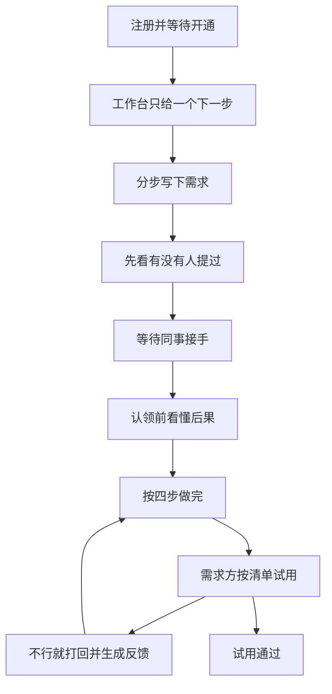

# 规格：让不会开发的同事独立走完一条需求

## 1. 本轮要达成什么

主用户是不会 Git、分不清 PR 和 Issue 的同事。成功标准：

- 新同事不问人，能注册、等到开通、写出一条别人看得懂的需求。
- 需求方只通过「现在该做什么」完成：补充、等待、试用、说哪里不行。
- 愿意接手的同事在认领前知道后果；认领后按四步做完，不必先读 Gitea 文档。
- 点错「认领」可以交还，不会把需求锁死。
- 界面主文案不出现 PR、CI、Issue、Webhook、仓库模板。这些词只出现在「给会开发的同事」折叠区。

已完成、本轮不重做：Docker / Gitea / 认领建仓 / Webhook / 反馈同步 Issue / 热力图 / SSO。对照见 [docs/architecture.md](docs/architecture.md)。

## 2. 人话词典

内部枚举不变，展示以 [apps/web/lib/labels.ts](apps/web/lib/labels.ts) 为唯一出口。主界面用下面的说法，括号内不要显示给普通同事。

- `OPEN`：等同事接手
- `CLAIMED`：已有人接手，还没开始改
- `DEVELOPING`：正在做
- `RELEASED`：请你试用
- `CLOSED`：已结束（不做了，或试用已通过）
- 共同需求人：我也想用（不会因此去写代码）
- 认领：我来做
- 协作者：一起做的同事（对方可以改代码）
- 反馈：哪里不行 / 还想加一点 / 我不会用
- Pull Request：一份待确认的修改（仅折叠区）
- CI：自动检查（仅折叠区；主界面说「自动检查过了 / 没过」）
- Issue：和「哪里不行」是同一件事，不单独教

进度环旁必须有一句当前阶段说明，例如：「同事已接手，还没提交修改。下一步通常是负责人去改，你只需等待。」不要只给百分比。

## 3. 交互总规则

- 每个页面同一时刻只有一个主按钮。其余放进「更多」。
- 不能点的操作不要藏起来，显示出来并写原因。例：「只有接手的同事能邀请一起做的人」。
- 会改变别人工作的操作，确认框必须写两句：会发生什么、不会发生什么。
- 通知、空列表、待办数字都必须能点，并且落地后就是那一件事（含正确的 tab 和筛选）。
- 从通知进来的地址以查询参数为准。详情页今天忽略 `?tab=feedback&feedbackId=`，本轮改为读取并回写。涉及 [apps/web/app/projects/[id]/page.tsx](apps/web/app/projects/[id]/page.tsx)、[apps/api/src/tasks/tasks.service.ts](apps/api/src/tasks/tasks.service.ts)。

### 3.1 三种人的主路径

需求方：注册 → 看开通说明 → 分步写需求 → 若已有相似需求则改为「我也想用」→ 等待 → 收到「请你试用」→ 逐条点通过或不行 → 不行则自动变成反馈并回到「正在做」。

接手的同事：补上「我能做的」→ 工作台看到匹配需求及原因 → 阅读接手说明 → 确认认领 → 四步工卡直到点「请对方试用」。

管理员：工作台第一条是「有 N 位同事在等开通」。通过前说明：对方能登录，并得到一个代码账号；拒绝必须写一句原因，对方再次登录时能看见。

同一个人可以既提需求又接手。引导按「当前最急的一件事」切换，不让用户先选死角色。

### 3.2 「现在该做什么」优先级

工作台顶部只渲染一条。规则固定，不用模型判断。做完再显示下一条。

1. 管理员且有待审核账号
2. 还没填「我能做的」（说明：不填就收不到适合你的需求）
3. 我提出的需求正处于「请你试用」且验收未完成
4. 我接手的需求里，有超过 3 天没回复的「哪里不行」
5. 我接手的需求还停在四步工卡的某一步
6. 有和我的技能重合的「等同事接手」（写明重合了哪几项）
7. 我的需求发布超过 7 天仍无人接手（建议补充，或看看是不是已经有人提过）
8. 都没有：主按钮「写下一条需求」，次按钮「看看同事的需求」

实现放在后端 `GET /projects/todos` 扩展字段 `nextAction: { title, reason, href, primaryLabel }`，前端不复制这套优先级。

### 3.3 教程放在哪

不单独做帮助中心长文。

- 注册成功页：三句话讲后续。管理员开通后你会收到通知；回来后先写你能做什么、或直接写需求；开通前不能认领、不能发布。
- 每个业务页右下角「我不会操作」：当前页最多三步，加一个写得好的短例子。首次进入默认展开，关闭后记在 localStorage，键名按页面区分。内容集中在 `apps/web/lib/guides.ts`，页面不各写一套。
- 空列表就是教程。例如需求池为空：「还没有需求。你可以写下自己工作里反复手工做的事。」按钮即发布向导。
- 折叠区「给会开发的同事」才放仓库、自动检查、修改记录。默认收起。

页面教程要点（每页三步，实现时写入 `guides.ts`）：

- 工作台：看顶部那一件事；做完它会换成下一件；数字卡片只是统计，先做顶部那件。
- 需求池：「我来做」表示你负责把它做完；「我也想用」只是报名使用，不会给你派开发任务。
- 写需求：按提问写，不要一次写完一篇；写完先看右边同事会看到的卡片；若列出相似需求，优先点「我也想用」。
- 详情：顶部一句话是阶段；主按钮是你的下一步；看不懂就点「问接手的同事」。
- 反馈：先选「不好用 / 和我说的不一样 / 还想加一点 / 我不会用」，不用先懂类型。
- 通知：点进去就到那件事，不必再找菜单。
- 个人资料：「我能做的」决定谁把需求推给你；代码技能可以不填。
- 用户审核：通过等于开通登录和代码账号；拒绝要写原因。

## 4. 必须先修的行为缺陷

这些不是美化，小白会直接踩坑。

- 筛选写回 URL，关键字输入防抖后再请求。[apps/web/app/projects/page.tsx](apps/web/app/projects/page.tsx) 今天改了筛选不改地址，刷新就丢。
- 关键字和「我参与的」用 AND 组合。[apps/api/src/projects/projects.service.ts](apps/api/src/projects/projects.service.ts) 的 `list()` 在 `scope=mine` 时会盖掉关键字的 `OR`。
- 状态不能从下拉里任意跳。允许的边：认领接口负责 `OPEN → CLAIMED`；有修改记录时可到 `DEVELOPING`；接手人或管理员可到「请你试用」；需求方验收通过后到已结束；取消需求到已结束并必填一句原因；`CLOSED` 只有管理员可重开。需求方不能把「请你试用」改回「等同事接手」。
- `PUT /projects/:id` 已存在，补「修改需求」入口。已接手后仍可改描述、验收清单、期望日期、技能；不能改已经用来建仓的标题标识。
- 业务标签和技能拆开。发布增加 `requiredSkills`，词表与个人资料「我能做的」相同（报表、Excel、审批、数据导出、车间看板等，保留少量开发技能）。匹配只用技能。标签只用于筛选。今天 `skills hasSome tags` 几乎对不上，定向通知发不出去。
- 通知类型分开：新需求匹配、状态变更、超期、催办，不再全部写成 `PROJECT_CLAIMED`。
- 同一对象、同一类型，7 天内已有未读或已发记录则定时任务不再插一条。
- 选人改为按姓名搜索 `/users/developers?keyword=`，禁止一次拉 100 条并吞掉错误。
- 误认领可交还：认领后负责人或管理员执行「交给别人做 / 交还需求池」。仓库保留，写权限收回，状态回到 `OPEN`，`ownerId` 清空，需求方收到人话通知。10 分钟内交还不要求填写理由；之后必填一句。这是本轮范围，因为主用户会点错。

## 5. 写需求、查重、试用

### 5.1 分步向导替换大表单

[apps/web/app/projects/new/page.tsx](apps/web/app/projects/new/page.tsx) 改为六步，每步一个问题、一个例子、一个「这样写太模糊」的反例。右侧实时预览需求卡片。每步写入 localStorage，关掉页面不丢；发布成功后清除。

1. 你现在怎么做这件事
2. 哪里费时或不容易出错
3. 希望变成什么样
4. 谁会用（可点选同事为共同需求人）
5. 怎样算做完：至少两条短句，存成验收条目，不再只有一大段文字
6. 希望哪天能用、需要的技能、图片

提交时拼成现有 `description`（四段小标题），验收条目另存。不会开发的人全程看不到 Git。

### 5.2 发布前查重

提交前用标题调用现有列表搜索，展示最多 3 条相似需求。每条两个按钮：「这就是我要的，我也想用」和「仍是一条新需求」。不自动拦截，但默认视觉重量在「我也想用」上。

### 5.3 试用验收

新增 `acceptance_items`：`projectId`、`content`、`sort`、`result(PENDING/PASSED/FAILED)`、`note`。

接手人点「请对方试用」后，需求方打开的不是状态下拉，而是清单：每条「试过了，可以」或「这里不行」加一句说明。有任一不行：项目回到 `DEVELOPING`，自动生成一条反馈，内容为未通过条目。全部通过：写入 `acceptedAt`，界面对需求方显示「已完成」。`CLOSED` 仍表示取消或管理员结束，避免「关闭」听起来像失败。

没有验收条目的旧数据：试用页退化为「整体可以用 / 整体不行」，不行时必填一句并生成反馈。

### 5.4 反馈的口语入口

详情和反馈中心先选四句话，再进入标题和内容：

- 不好用 → `BUG`
- 和我当初说的不一样 → `BUG`
- 还想加一点 → `IMPROVEMENT`
- 我不会用 → `QUESTION`，提示「这不一定是程序坏了」，并给出当前页三步教程的摘录，鼓励先看再提交

「我不会用」仍允许提交，方便接手人回答。

### 5.5 问接手的同事

需求方在详情点「我有个问题」。生成一条 `QUESTION` 反馈，预填「我想问：」。不新做聊天系统。接手人在反馈抽屉里回复，回复同步到已有 Issue 评论。

## 6. 认领与四步工卡

认领确认框固定文案结构：

- 会发生：你成为负责人；系统建一个只有公司内部能看的代码库；需求方收到通知；其他人不能再点「我来做」。
- 不会发生：不会自动通知全公司；共同需求人不会获得改代码的权限。
- 若技能重合为 0：黄字「这条更适合会某某的同事。如果你不会做，请关掉并点我也想用。」仍允许确认。

认领成功后，详情顶部改为工卡，完成条件取自已有数据，不靠用户自己打勾：

1. 打开代码库（按钮走现有 SSO）。说明：平台会帮你登录。
2. 提交一版修改（出现至少一条修改记录即完成）。
3. 自动检查通过（最新一条 `ciStatus=success`；失败时人话：「检查没过，先看代码库里的记录，不要点请对方试用」）。
4. 点「请对方试用」。检查未通过时允许继续，但确认框写明风险。

## 7. 视觉要求

保持 Ant Design 5。视觉为目标服务：主按钮唯一、阶段一句话可读、折叠区收起术语。

- 主题变量收进 [apps/web/app/globals.css](apps/web/app/globals.css) 与 [apps/web/app/layout.tsx](apps/web/app/layout.tsx)。
- [apps/web/components/AppShell.tsx](apps/web/components/AppShell.tsx)：侧栏保留现有菜单文案；未读数在「消息通知」上；顶栏只留代码库入口（对需求方改名为「给开发同事的代码库」并加提示）和用户菜单。
- 登录页左侧三步图：写下需求、同事接手、你来试用。不讲架构。
- 工作台统计卡降为第二屏。第一屏只有下一步和「我提出的 / 我在做的」两条列表，每行带阶段人话。
- 需求卡片信息顺序固定：标题、阶段人话、谁提出、谁在做、期望日期（「还有 N 天」或「已晚 N 天」）、唯一主按钮。
- 详情拆成页头、说明、工卡或试用清单、反馈。反馈抽屉与反馈中心共用一个组件。
- 窄屏隐藏工卡里的代码细节，只保留阶段说明、下一步和试用按钮。
- 列表用骨架屏，不用整页转圈挡住教程。

## 8. 后端配套

- 状态机放在 `projects.service` 的 `updateStatus`，非法跳转返回人话，例如「请使用认领，不能直接改成已接手」。
- `expectedAt` 已过且未试用通过时，列表项带 `overdue: true` 和 `overdueDays`。
- 催办：`POST /projects/:id/nudge`。需求方或共同需求人对「等同事接手」或已逾期的需求使用。7 天内同一项目只发一次，返回「已提醒过，请再等等」。
- 时间线不新建审计表。由认领、验收、反馈、修改记录拼句子，例如「周二 张三接手了」「周三 自动检查没通过」。详情只读展示。
- PR 列表去掉写死的 20 条，改为分页；主界面不叫 PR。
- 邮件仅在已配置 SMTP 时发送，且只有四件事：开通账号、有人接手、请你试用、验收没通过。正文用人话加一个链接。评论不发信。
- 权限失败信息与界面禁用原因使用同一套句子，集中在后端常量，避免按钮能点但返回 403 英文。

## 9. 后续功能规格

下面每条都是可单独排期的完整行为，本轮不做。排期时优先前 6 条，它们继续减少小白卡顿；后文是完整目录，避免再变成口号清单。

### 优先的下一批

1. 部门场景包。写需求第 0 步选「生产日报 / 审批流转 / 从系统导出表 / 车间看一块屏 / 自定义」。选中后预填六步例子和两条验收句，用户只改自己的系统名和字段。解决空白页不知写什么。依赖本轮向导。
2. 移交负责人。与「交还需求池」不同：指定另一位已开通同事，必填交接一句，仓库写权限从原负责人转走，双方和需求方都收到通知。用于认领后发现做不了、或人请假。依赖本轮交还接口，把 `ownerId` 改派而不是清空。
3. 缺信息提问单。接手人从模板勾选「你用的是哪个系统、给一份示例、谁来拍板、怎样算错」。需求方收到的是填空，不是空白评论。未回答前「请对方试用」仍可用，但工卡上显示「还缺需求方的回答」。不阻塞，避免开发被卡死。
4. 示例对照。内置两条不可认领的示范需求：一条六步都具体，一条只有「做个报表」。写需求页可并排查看。数据用种子脚本写入，`projects.demo = true`，列表默认折叠在「看一个例子」。
5. 周一封给人的周报。只发给有未完成事项的人，不发给全员。内容最多三行：你有几条该试用、几条该回复、几条等了超过 7 天。站内一条通知；SMTP 开启时同一封邮件。没有事项的人不发。
6. 技能用场景说法收集。个人资料不只丢一个标签框。按「我常帮同事做：表、审批、页面、接口、我暂时只会提需求」多选，映射到 `skills`。纯需求方可以明确选「我暂时只会提需求」，系统就不再推认领，只推「你可能也想用」。

### 其余目录

7. 草稿上云。向导草稿除 localStorage 外增加 `project_drafts`，换电脑还能继续。未发布超过 30 天删除。本轮 localStorage 够用。
8. 验收条目评论。某一条「这里不行」可单独回复，而不是合成一条大反馈。适合一次试用有多处问题。依赖本轮 `acceptance_items`。
9. 进度订阅。共同需求人默认只在「请你试用」和「已完成」时收到通知，避免每次评论都响。需求方可在详情打开「每一步都告诉我」。
10. 催办回执。被催的负责人点「我这周会做」或「我做不了」，后一句引导交还或移交。需求方看到的是这句人话，不是已读。
11. 相似需求在列表里分组。标题很近的「等同事接手」收成一组，减少池子里十条日报。只做提示，不自动合并。
12. 管理员开通回执。通过后页面生成一段可复制的话，让管理员贴到微信：「账号已开通，用这个邮箱登录，先看页面顶部让你做的那一件事。」避免口头转述 Git 密码。密码仍只在审核成功时显示一次。
13. 拒绝原因再登录可见。注册被拒的人打开登录页时，在错误提示下看到管理员写的那一句和下一步（改邮箱重新注册或联系谁）。
14. 操作失误的 10 分钟撤销扩展到「请对方试用」。点错后 10 分钟内可收回，验收清单回到未开始，并通知需求方「先不用试」。超时后只能走验收打回。
15. 窄屏专用的「只看我的」。底部两个入口：我提出的、等我试用。不提供认领和邀请协作者，避免在手机上误点。
16. 时间线导出一页纸。把阶段、验收清单、未解决问题导出成可转发的纯文本，方便贴到微信群。不做 PDF 服务。
17. 接手人请假标记。个人资料可填「这周不接新需求」，匹配和推荐跳过此人，已接手的项目不受影响。
18. 需求方补充材料。详情对图片和附件在发布后仍可追加，并通知负责人「需求方又给了一份例子」。现在附件只在创建时挂上。
19. 自动检查失败的人话摘要。回调里若带失败步骤名，详情只显示「第 2 步测试没过」，链接到代码库日志。不解析完整日志。
20. 只读看板。按四个阶段分列，卡片点进详情。不允许拖拽改状态，以免绕过试用清单。
21. 批量审核。管理员一次通过多名待审核同事，每人仍单独生成代码账号，结果表列出成功和失败原因。
22. 通知免打扰。除「请你试用」和「账号开通」外，可关闭某类通知。这两类不可关。
23. 搜索只搜标题和验收句。描述太长，小白搜「日报」会被无关长文淹没。高级搜索再包含正文。本轮关键字行为保持，此项专改相关度。
24. 首次登录不强制看完幻灯片。教程以「我不会操作」和空状态为准。明确不做独立新手任务系统、积分和徽章，避免像游戏。

明确不做：头像上传、全局搜索、全量审计日志、拖拽看板、每条评论发邮件、帮助中心维基、用大模型替用户写需求。向导的例子是写死的；若以后接模型，只允许把已填的六步整理成四段描述，必须人工确认后才能发布。
