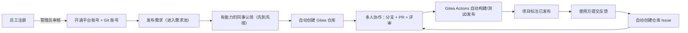
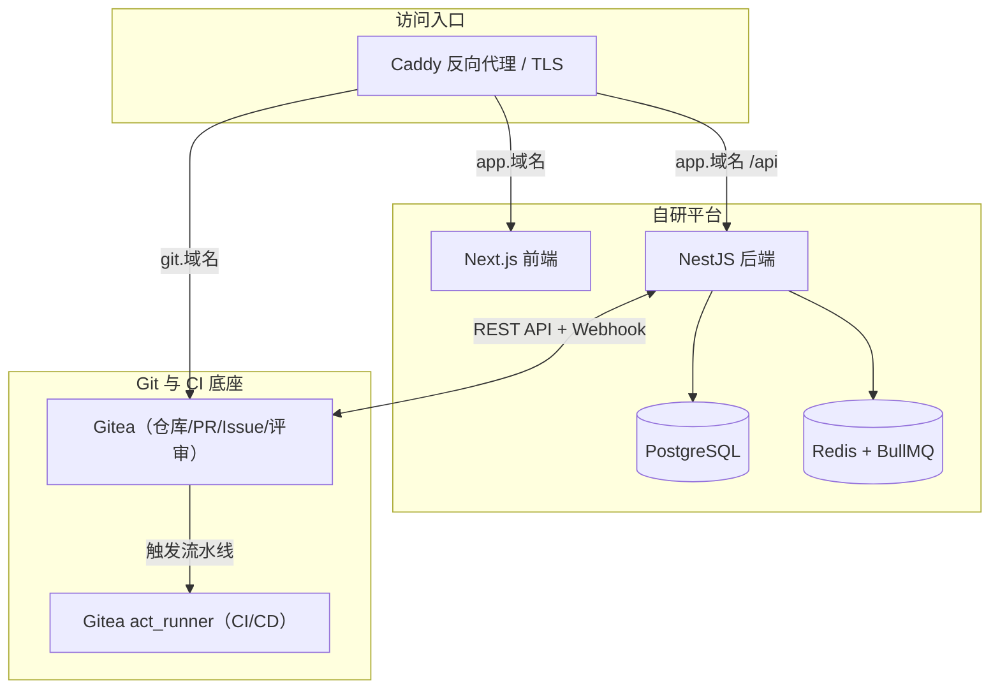

# 内部需求协作平台

面向公司内部的「需求发布 → 认领 → 协作开发 → 发布 → 反馈迭代」一体化平台。
以自建 **Gitea + Gitea Actions** 作为 Git 与 CI/CD 底座，自研平台通过 Gitea API
把仓库、Pull Request、Issue、流水线状态与业务数据打通。

## 解决什么问题

| 现状痛点 | 平台能力 |
| --- | --- |
| 不会开发的同事有需求，只能口头找人 | 结构化需求表单发布需求单，进入公开需求池 |
| 有开发能力的同事不知道别人的需求 | 需求池 + 标签订阅，新需求按能力标签定向通知 |
| 多人重复开发相同功能 | 需求单唯一化，且认领采用「先到先得」原子锁 |
| 缺少规范的协作与发布流程 | 自动建仓（含模板）、PR 评审、Gitea Actions CI/CD |
| 交付后没人管后续问题 | 平台内反馈自动同步为仓库 Issue，形成迭代闭环 |

## 核心流程



## 架构



## 技术栈

| 层次 | 选型 |
| --- | --- |
| Git 与 CI 底座 | Gitea 1.22（兼容 GitHub API）+ act_runner（兼容 GitHub Actions 语法） |
| 后端 | NestJS 10 + TypeScript + Prisma + PostgreSQL 16 + BullMQ/Redis 7 |
| 前端 | Next.js 14（App Router）+ React 18 + Ant Design 5 |
| 认证 | 邮箱注册 + 管理员审核 + JWT |
| 部署 | Docker Compose 单机部署（适合 100 人以内） |

## 快速开始

### 1. 准备环境变量

```bash
cp .env.example .env
# 必须修改的项：POSTGRES_PASSWORD、REDIS_PASSWORD、JWT_SECRET、
#              GITEA_ADMIN_PASSWORD、GITEA_WEBHOOK_SECRET、ADMIN_PASSWORD
```

### 2. 启动基础设施（数据库 / 缓存 / Gitea / Runner）

```bash
docker compose up -d postgres redis gitea
```

### 3. 初始化 Gitea（创建管理员、组织、API Token、Runner 令牌、仓库模板）

```bash
chmod +x deploy/gitea/init.sh
./deploy/gitea/init.sh
```

脚本会：

- 创建 Gitea 管理员账号
- 创建组织 `GITEA_ORG`（默认 `projects`），所有项目仓库都放在该组织下
- 生成平台调用 Gitea 的 API Token（含 `write:admin` 等权限）并自动写回 `.env`
- 生成 act_runner 注册令牌并写入 `deploy/runner/.registration-token`
- 从 `deploy/templates/repo-template` 初始化 / 同步仓库模板

> 脚本可重复执行。修改了 `deploy/templates/repo-template` 后重新执行即可同步模板，
> 只影响之后新建的仓库。

### 4. 重启 Runner 完成注册

```bash
docker compose restart gitea-runner
```

### 5. 启动平台

```bash
docker compose up -d --build api web caddy
```

### 6. 访问

| 服务 | 地址 | 说明 |
| --- | --- | --- |
| 需求协作平台 | <http://localhost:8080> | 使用 `.env` 中 `ADMIN_EMAIL` / `ADMIN_PASSWORD` 登录 |
| Git 服务（Gitea） | <http://localhost:8081> | 平台顶部「代码仓库」按钮一键免密进入；也可用 `GITEA_ADMIN_USER` 账号密码登录 |
| 接口文档 | <http://localhost:8080/api/docs> | 非生产环境下自动开启的 Swagger |

> 平台与 Git 服务使用**同一主机名、不同端口**，这是免密登录（SSO）能生效的前提：
> 浏览器 Cookie 只按主机名共享、不区分端口。本地统一用 `localhost`，局域网内换成服务器 IP
> （例如 `http://192.168.1.10` + `http://192.168.1.10:8081`）。
>
> ⚠️ 不要配成 `app.localhost` + `git.localhost` 这类**主机名不同**的组合 —— 那样 SSO 一定失效，
> 从平台点进 Git 服务会退回 Gitea 登录页。生产环境请让两个服务共用一个域名的不同端口/路径。
>
> 使用真实域名时，将 `.env` 中的 `APP_DOMAIN`、`GITEA_DOMAIN`、`APP_URL`、
> `GITEA_ROOT_URL` 改为实际域名，Caddy 会自动申请并续期 HTTPS 证书。
>
> 若宿主机 80/443 已被占用（例如已有 Nginx），可设置 `CADDY_HTTP_PORT` / `CADDY_HTTPS_PORT`
> 改端口，并同步调整 `APP_URL`、`API_URL`、`GITEA_ROOT_URL`。

### 7. 写入演示数据（可选）

空库只有一个管理员账号，页面看上去比较冷清。仓库内提供了一个可重复执行的演示数据脚本，
按一家「智能装备制造企业」的实际场景写入 20 位同事、21 个需求（待认领 / 已认领 / 开发中 /
已交付 / 已关闭）、反馈与讨论、Pull Request、附件与站内通知，并把时间打散到过去 11 个月，
让首页与个人页的协作热力图看上去像真实积累。

```bash
# 清理 E2E 测试数据 + 重建整套演示数据（含 Gitea 账号、仓库、Issue）
docker compose exec -T api npm run seed:demo

# 保留 E2E 数据，只重建演示数据
docker compose exec -T api npm run seed:demo -- --keep-e2e

# 只写数据库，不连 Gitea（例如 Gitea 未就绪时）
docker compose exec -T api npm run seed:demo -- --skip-gitea
```

脚本做了三件事，反复执行结果一致（不会产生重复数据）：

1. **清理**：删掉 E2E 脚本产生的测试账号（`*@e2e.example.com` 与历史遗留的
   `requester-数字@example.com`）以及上一次写入的演示账号 —— 只按脚本自己登记的邮箱清单精确删除，
   同事自己注册的账号不受影响；
2. **写入**：人员 / 需求 / 认领 / 共同需求人 / 反馈 / PR / 附件 / 通知，附件是真实落盘的文件，
   点开即可预览与下载；
3. **同步 Git 服务**：按仓库模板创建 15 个项目仓库，配置 Webhook 与流水线回调，
   并把每条反馈同步成仓库里的真实 Issue（带 `bug` / `enhancement` / `question` 标签和讨论），
   因此需求详情页的仓库地址、反馈里的 Issue 链接都能直接打开。

演示账号（密码统一为 `Demo@123456`，可用环境变量 `DEMO_PASSWORD` 覆盖）：

| 身份 | 账号 | 说明 |
| --- | --- | --- |
| 管理员 | `admin@aimanager.com` / `Admin@123456` | 同时是 Gitea 站点管理员，可免密进入 Git 服务 |
| 需求方 | `zhang.wei@aimanager.com` | 生产部 张伟，能看到「我提的需求」与个人热力图 |
| 认领人 | `zhou.hang@aimanager.com` | 研发中心 周航，负责多个开发中项目 |
| 待审核 | `shen.meng@aimanager.com` | 未审核账号，用于演示「用户审核」 |

> 演示数据的邮箱域名取自 `.env` 中的 `ADMIN_EMAIL`（默认 `admin@aimanager.com`，即域名 `aimanager.com`）。
> 脚本会同步把管理员邮箱对齐到 `ADMIN_EMAIL`，保证演示数据域名统一；E2E 测试账号则统一使用
> `e2e.example.com`，两类数据互不干扰。

### 8. Git 账号名与仓库名的生成规则

平台会自动把中文姓名、中文需求标题转成拼音，避免出现 `user_ab12cd`、`req-project-9f3e` 这类
看不出含义的标识：

| 场景 | 规则 | 示例 |
| --- | --- | --- |
| Gitea 用户名 | 姓名转拼音，重名时依次追加 2、3 | 张伟 → `zhangwei`；陈晓东 → `chenxiaodong` |
| 仓库名 | `req-` + 标题拼音（音节间用 `-`）+ 随机后缀 | 物料齐套率分析与预警 → `req-wu-liao-qi-tao-lv-fen-xi-yu-yu-b0ad7b` |

约 32 个字符后按音节边界截断（不会切出半个拼音），`ü` 统一写作 `v`（`率` → `lv`，
与中文输入法习惯一致），中英混排标题里的英文单词原样保留。

### 9. 进入 Git 服务（免密登录）

员工在平台里点顶部「代码仓库」、需求详情里的仓库地址、或反馈里的 Issue 链接，
都会直接进入已登录的 Gitea，不需要再记一套 Git 密码。实现方式：

1. 平台登录态是 JWT（localStorage）；为保证**任何入口**都能免密，平台在
   「登录成功」和「恢复登录态」时都会调用 `POST /api/gitea/session`，写入一枚 httpOnly 的 SSO Cookie；
2. Caddy 在 Git 站点上先用 `forward_auth` 回调 `GET /api/auth/gitea-verify` 校验该 Cookie；
3. 校验通过后把 Gitea 用户名 / 邮箱放进 `X-Gitea-User`、`X-Gitea-Email` 请求头，
   Gitea 开启「反向代理认证」后据此自动登录；
4. 校验失败时 `gitea-verify` 会 302 到 `/login?redirect=<原始 Git 地址>`，
   登录成功后先补签发 SSO Cookie，再自动跳回刚才要看的那个仓库页面
   （所以直接打开 Git 地址、或 Cookie 过期后再访问，都不会"点了还要登录"）。

> ⚠️ **主机名必须一致**：Cookie 只按主机名区分、不区分端口，因此平台与 Git 服务必须使用
> 同一主机名（本地统一 `localhost`，局域网统一服务器 IP）。
> 不要配成 `app.localhost` + `git.localhost` 这种组合，否则 SSO 一律失效。
> `GITEA__security__REVERSE_PROXY_AUTHENTICATION_USER` 必须写在 `[security]` 段
> （`GITEA__service__REVERSE_PROXY_AUTHENTICATION_*` 会被忽略，退回到默认的 `X-WEBAUTH-USER`）。
> 另外 Caddy 的 `@gitea_bypass` 放行列表（静态资源、`/api/*`、`/user/login`、`*.git`）
> 必须用**单条正则**表达"或"，否则 `path` 与 `path_regexp` 会被按"与"处理而导致全站强制登录。

## 验收自测

```bash
bash scripts/e2e-test.sh
```

覆盖：注册/审核开通 Git 账号 → 发布需求（可带图片与附件） → 认领并自动建仓 → 推送分支与 PR（Webhook 同步）
→ **真实流水线运行并把 CI 结果回写平台** → 反馈同步为 Issue → 反馈闭环 → 协作者权限 → 通知与统计
→ 头像与需求池展示（任务头像 / 完成进度 / 需求方与负责人分列）→ 共同需求人（管理员代加 / 自助加入 / 自助退出 / 越权被拒）
→ 协作热力图（全平台 / 个人）→ 需求图片与附件（上传 / 预览 / 下载）→ Git 服务免密登录（SSO / 弹回后带回原地址）与品牌定制。

测试账号使用真实姓名（张磊 / 顾小雨 / 郭鹏）与专用域名 `e2e.example.com`，
邮箱局部带上时间戳保证唯一。这样即使测试数据留在环境里，页面上看到的也是一个个真实的人，
而不是「需求方1712…」；`npm run seed:demo` 会按域名精确清理这些账号。

## 使用流程（给同事的说明）

> 平台**不区分「需求方账号」和「开发方账号」**：同一个人既能提需求，也能认领别人的需求去实现。
> 页面上的「提出人 / 负责人 / 共同需求人」只是某个需求上的角色，不代表账号类型。

1. **注册**：用公司邮箱注册，等待管理员审核；审核通过后系统自动开通 Git 账号，
   初始密码通过邮件发送（也可由管理员在「用户审核」页一次性查看）。
2. **完善资料**：在「个人资料」里点「更换头像」，从内置的人物插画头像里挑一个；
   再填上「我能帮上的方向」，有相关标签的新需求发布时会通知你。
3. **提需求**：进入「发布需求」，选一个任务头像，写清背景、痛点、期望效果与验收标准；
   可上传**图片**（需求页以画廊形式直接显示）和**附件**（供同事下载）。
4. **认领需求**：在「需求池」以卡片浏览需求（**点卡片任意位置即可进详情**），认领后系统自动创建仓库并授予推送权限；
   卡片上的**环形进度**会随状态与 PR 合并情况自动推进，状态文字就在圆环中间。
5. **一起提需求**：看到和自己诉求相同的需求，可在需求池点「我也需要」把自己的头像加到提出人旁边，
   不想要了随时点「退出共同需求人」；**只有平台管理员**能替别人增删共同需求人名单
   （共同需求人只影响需求范围统计，不涉及仓库代码权限）。
6. **协作开发**：点顶部「代码仓库」**免密进入** Gitea，克隆仓库，按 `CONTRIBUTING.md` 的分支规范提交 PR，
   通过 CI 与评审后合并；打 `v*` 标签可触发发布流水线。
7. **提交反馈**：使用方在项目页提交反馈，平台自动创建仓库 Issue；
   开发者在平台或 Gitea 中回复，状态标记「已解决」会自动关闭 Issue。
8. **看热力图**：工作台首页有全平台协作热力图，个人资料页有个人热力图（近 12 个月，按天统计）；
   首页「需求总数 / 待认领 / 开发中 / 待处理反馈」四个统计卡片可直接点进对应的筛选列表。

## 目录结构

```
aiManager/
├── docker-compose.yml           # 一键编排所有服务
├── Caddyfile                    # 反向代理与 TLS
├── .env.example                 # 环境变量样例
├── deploy/
│   ├── postgres/                # 数据库初始化脚本
│   ├── gitea/                   # Gitea 配置与一键初始化脚本
│   ├── runner/                  # act_runner 配置
│   └── templates/               # 仓库模板与 CI/CD 流水线模板
├── apps/
│   ├── api/                     # NestJS 后端（56 个源文件）
│   └── web/                     # Next.js 前端（含头像、进度条、热力图组件）
└── docs/                        # 架构与运维文档
```

- 详细架构与数据模型见 [docs/architecture.md](docs/architecture.md)
- 部署、备份与排障见 [docs/operations.md](docs/operations.md)
- 本地开发（不使用容器）见 [docs/development.md](docs/development.md)

## 常见问题

**Q：认领后没有自动创建仓库？**
A：先确认 `deploy/gitea/init.sh` 已执行成功（`.env` 中 `GITEA_API_TOKEN` 非空），
   然后在项目详情页点击「立即创建」重试。

**Q：PR 状态没有同步到平台？**
A：Webhook 可能投递失败。可在项目详情页点击「同步仓库 PR」手动拉取一次；
   或在 Gitea 仓库 Settings → Web Hooks 中查看投递记录。

**Q：CI 没有执行？**
A：确认 `docker compose logs gitea-runner` 中 Runner 已注册为 Idle 状态，
   并检查仓库 `.gitea/workflows/ci.yml` 是否存在。

**Q：CI 执行了，但失败在「拉取代码」？**
A：说明流水线任务容器网络不通。确认 `deploy/runner/config.yaml` 里的
   `container.network` 与 Compose 网络名（默认 `<项目名>_backend`）一致，
   然后执行 `docker compose up -d --force-recreate gitea-runner` 让配置生效。

**Q：平台里 PR 的 CI 状态一直不变？**
A：Gitea 1.22 的 Webhook 不支持订阅流水线事件，平台改用「工作流主动回调」方案：
   工作流结束时会带着 `X-CI-Token` 请求 `POST /api/webhooks/ci`。
   若状态不变，检查仓库的 `.gitea/workflows/ci.yml` 中 `CI_CALLBACK_URL` /
   `CI_CALLBACK_TOKEN` 是否已被平台替换为真实值（新建仓库时自动完成）。

**Q：邮件没收到？**
A：`MAIL_ENABLED=false` 时平台只记录日志不发邮件，站内通知仍正常推送。
