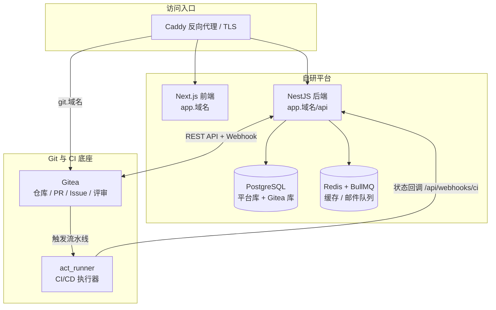
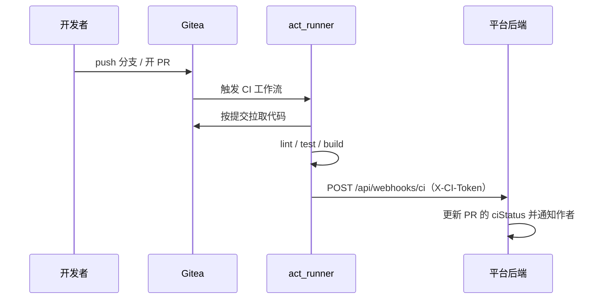

# 架构说明

> 本文档描述内部需求协作平台的整体架构、数据模型与关键集成点。

## 一、整体架构



- 平台自身只负责「需求 / 项目 / 认领 / 反馈 / 通知」等业务数据；
  代码托管、PR 评审、Issue、流水线全部交给 Gitea，避免重复造轮子。
- 平台与 Gitea 之间是双向的：
  - **平台 → Gitea**：创建账号、建仓、配置 Webhook、创建/关闭 Issue、授权协作者。
  - **Gitea → 平台**：Webhook 回写 PR、Issue、推送事件；流水线结束后由工作流回调平台。

## 二、目录结构

```
aiManager/
├── docker-compose.yml              # 单机编排：postgres / redis / gitea / runner / api / web / caddy
├── Caddyfile                       # 反向代理与 TLS
├── .env.example                    # 环境变量样例
├── deploy/
│   ├── postgres/init-databases.sh  # 创建 Gitea 独立数据库
│   ├── gitea/app.ini               # Gitea 配置
│   ├── gitea/init.sh               # 一键初始化：管理员/组织/Token/Runner 令牌/仓库模板
│   ├── runner/config.yaml          # act_runner 配置（含流水线网络）
│   └── templates/
│       ├── repo-template/          # 新项目仓库模板（README、CONTRIBUTING、workflows、Issue 模板）
│       └── workflows/              # 通用流水线模板（Node.js / Docker / 静态站点）
├── apps/
│   ├── api/                        # NestJS 后端
│   └── web/                        # Next.js 前端
├── scripts/e2e-test.sh             # 端到端验收脚本
└── docs/                           # 架构 / 运维 / 开发文档
```

## 三、数据模型（平台库）

| 表 | 说明 | 关键字段 |
| --- | --- | --- |
| `users` | 平台用户 | `email`、`name`、`role(EMPLOYEE/ADMIN)`、`status(PENDING/ACTIVE/DISABLED)`、`skills[]`、`avatarUrl`、`giteaUsername`、`giteaInitialPassword` |
| `projects` | 需求单 / 项目 | `title`、`description`、`acceptanceCriteria`、`tags[]`、`avatar`、`status`、`creatorId`、`ownerId`、`repoOwner`、`repoName`、`repoUrl` |
| `project_members` | 项目成员与权限（会同步仓库写权限） | `projectId`、`userId`、`role(OWNER/COLLABORATOR)` |
| `project_claims` | 认领记录（先到先得） | `projectId`、`userId`、`claimedAt`、`remark` |
| `project_requesters` | 共同需求人（只是「我也需要」，不涉及仓库权限） | `projectId`、`userId`、`createdAt`（`projectId + userId` 唯一） |
| `feedbacks` | 使用方反馈 | `projectId`、`userId`、`type(BUG/FEATURE/OTHER)`、`title`、`content`、`status(OPEN/PROCESSING/RESOLVED/CLOSED)`、`issueNumber` |
| `feedback_comments` | 反馈回复 | `feedbackId`、`userId`、`content` |
| `pull_requests` | 仓库 PR 镜像 | `projectId`、`number`、`state`、`merged`、`ciStatus(PENDING/SUCCESS/FAILURE/UNKNOWN)`、`headBranch` |
| `notifications` | 站内通知 | `userId`、`type`、`title`、`content`、`link`、`read` |

项目状态流转：`OPEN`（需求池）→ `CLAIMED`（已认领并建仓）→ `DEVELOPING`（有 PR）→ `RELEASED`（发布）→ `ARCHIVED`。

## 四、关键集成点

### 1. 账号开通

管理员审核通过 → 平台调用 `POST /api/v1/admin/users` 在 Gitea 建号（需 `write:admin` 权限），
用户名为「邮箱前缀 + 短哈希」，初始密码由平台生成并记录，邮箱通知用户。

### 2. 自动建仓

认领时调用 `POST /api/v1/repos/{org}/repo-template/generate`，
基于模板仓库生成 `projects/<需求标题>-<短哈希>` 私有仓库，随后：

1. `POST /api/v1/repos/{owner}/{repo}/hooks` — 配置 Webhook（签名密钥 `GITEA_WEBHOOK_SECRET`）。
2. 把 `.gitea/workflows/*.yml` 中的 `__CI_CALLBACK_URL__` / `__CI_CALLBACK_TOKEN__`
   替换为真实回调地址与令牌并提交（`configureCiReporting`）。
3. `PUT /api/v1/repos/{owner}/{repo}/collaborators/{user}` — 为项目成员授予写权限。

### 3. 事件同步（Gitea → 平台）

Webhook 入口：`POST /api/webhooks/gitea`，通过 `X-Gitea-Signature` 做 HMAC-SHA256 校验。

| 事件 | 平台动作 |
| --- | --- |
| `push` | 对应分支的未合并 PR 置为「流水线运行中」 |
| `pull_request` | upsert PR 记录；`opened` 时项目转为 `DEVELOPING`，并通知负责人与成员 |
| `pull_request_review_*` | 通知 PR 作者有新的评审意见 |
| `issues` | Issue 关闭时把反馈置为 `RESOLVED`；重新打开则回到 `OPEN` |
| `issue_comment` | 同步 Issue 评论为反馈回复，并通知反馈人和负责人 |
| `release` | 项目置为 `RELEASED`，通知需求方验收 |

> Gitea 1.22 的 Webhook 事件列表不包含 `status` / `workflow_run`（无法订阅流水线事件），
> 且该版本没有 Actions 查询 API，因此流水线状态改由**工作流主动回调**平台。

### 4. 流水线状态回调（工作流 → 平台）



- 回调地址与令牌在**建仓时写入仓库的 workflow 文件**（内网地址 `http://api:4000`，仅容器网络可达）。
- 令牌校验：`CI_CALLBACK_TOKEN`（未配置时复用 `GITEA_WEBHOOK_SECRET`）。
- 分支名使用 `github.head_ref || github.ref_name`，保证 PR 事件也能匹配到正确分支。

### 5. 反馈迭代闭环

平台反馈 ↔ 仓库 Issue 双向同步：

1. 使用方在项目页提交反馈 → 平台创建 Issue（自动创建标签），记录 `issueNumber`。
2. 开发者在 Gitea 或平台回复 → 双向同步评论。
3. 反馈标记「已解决」→ 平台关闭 Issue；Issue 被关闭 → 平台把反馈置为 `RESOLVED`。

## 五、流水线模板设计

`deploy/templates/repo-template/.gitea/workflows/` 下的模板刻意**不依赖 GitHub Marketplace 的 Action**：

- 拉取代码改为 `git init + git fetch <sha>`，令牌来自 `secrets.GITHUB_TOKEN`；
- 发布改为直接调用 Gitea Release API；
- 好处：在内网、无外网出口的环境下流水线也能跑通（act_runner 无需从 github.com 拉取 Action）。

`deploy/templates/workflows/` 提供 Node.js CI、Node.js 发布、Docker 镜像、静态站点四套可选模板，
复制到项目仓库 `.gitea/workflows/` 即可使用。

## 六、展示层的三块派生数据

### 1. 完成进度（`project.progress`）

状态是离散的，进度条是连续的，二者由 `common/utils/progress.util.ts` 统一换算，前端只负责渲染：

| 状态 | 进度 |
| --- | --- |
| `OPEN` | 10% |
| `CLAIMED` | 35% |
| `DEVELOPING` | 55% + 35% × 已合并 PR 占比（即 55%~90%） |
| `RELEASED` / `CLOSED` | 100% |

列表接口为避免 N+1，会先取本页项目，再用一次 `groupBy` 统计各项目已合并的 PR 数。

### 2. 头像（预设，无外部图床）

内网部署不使用外部图床，头像统一存标识（`user-01` / `task-01`）而不是图片地址，
由前端 `lib/avatars.ts` 渲染成 emoji + 渐变底色；后端 `common/constants/avatars.ts` 负责校验。

> ⚠️ 两份预设列表必须保持一致；新增头像时同步修改这两个文件。
> 取值同时兼容 `https://` 图片地址，便于后续接入上传功能。

### 3. 协作热力图（`GET /api/stats/heatmap`）

数据来自 6 张行为表的 `UNION ALL`（发布需求、认领、加入共同需求人、提交反馈、反馈评论、提交 PR），
按天聚合后补齐空档日期返回整段区间：

- 不传 `userId` → 全平台汇总（工作台首页）；
- 传 `userId` → 个人热力图（个人资料页）；
- 同时返回 `summary`（各类行为累计数）、`currentStreak` / `longestStreak`（连续活跃天数）。

`from` 会对齐到所在自然周的周一，前端用 `grid-auto-flow: column` 直接铺成周列，无需再做对齐计算。
